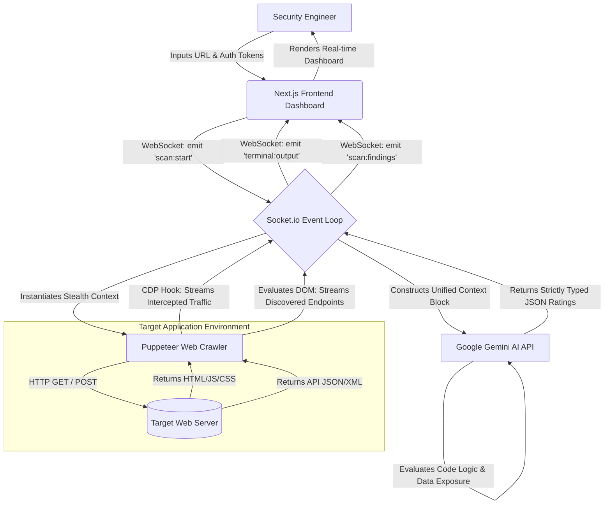
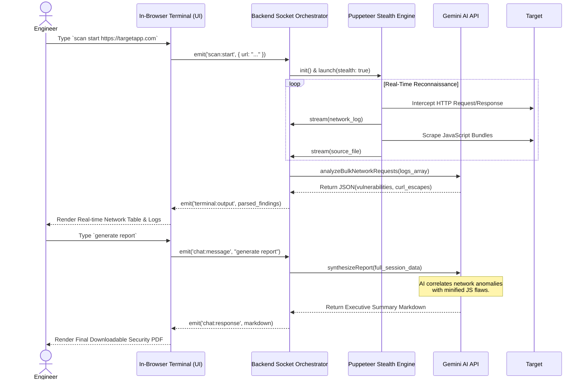

# Comprehensive Project Analysis & Deep System Report
## Website Vulnerability & Security Intelligence Platform ("Krpterisio" / DeepTechno)

---

## 1. About the System
The "Website Vulnerability & Security Intelligence Platform" (internally referenced as Project Krpterisio featuring the DeepTechno AI agent) is a state-of-the-art, AI-augmented cybersecurity ecosystem engineered on a Full-Stack Next.js 15 App Router architecture. Security testing has historically been a fragmented process, demanding disparate tools (such as proxy interceptors, static code analyzers, and network fuzzers) to achieve a complete security posture. Project Krpterisio unifies these capabilities into a single, cohesive, web-based platform. 

Unlike traditional vulnerability scanners that rely exclusively on static, signature-based detection mechanisms (which often yield high false-positive rates and lack context), this system integrates a highly interactive artificial intelligence agent. Powered by Google's Gemini-2.0-Flash foundational model, the DeepTechno agent digests real-time application behavior, interprets complex DOM structures, and analyzes intercepted HTTP traffic to provide developer-friendly explanations, predict realistic business impacts, and generate secure code remediation snippets.

The execution core of the system is driven by a custom-built, stealth-oriented Web Crawler. Utilizing `puppeteer-extra-plugin-stealth`, the crawler mimics human interaction patterns to negotiate modern Web Application Firewalls (WAFs), CAPTCHA gates, and Cloudflare challenges. As it traverses the target web application, it intercepts live network traffic via the Chrome DevTools Protocol (CDP), extracting headers, cookies, and JSON payloads. This telemetry is streamed instantaneously to the user's browser via a robust Socket.io bidirectional connection, rendering insights within a bespoke, terminal-like user interface (`xterm.js`). This allows security engineers to orchestrate complex audits seamlessly from a centralized dashboard without installing local dependencies.

---

## 2. SYSTEM ANALYSIS

### 2.1 Abstract
The modern web landscape is characterized by an exponential increase in application complexity. The shift towards Single Page Applications (SPAs), microservices, and extensive third-party API integrations has inadvertently expanded the attack surface. Cybersecurity threats such as undocumented API route leaks, cloud misconfigurations, cross-site scripting (XSS), server-side request forgery (SSRF), and broken authentication mechanisms are prevalent. 

Traditional heuristic scanners provide detection capabilities but fundamentally lack contextual intelligence. They flag anomalies but fail to understand the business logic behind the data flows. This project proposes the design and development of an AI-Powered Website Vulnerability & Security Intelligence Platform. The system introduces an unprecedented paradigm in web security: it performs deep website reconnaissance, intercepts deep network requests natively within a headless browser context, and streams this data to an AI risk-analysis layer. The platform's defining characteristic is its in-browser terminal-driven scanning engine, allowing users to converse with the "Deep Techno" AI to understand exactly how a vulnerability can be exploited and how to patch it within their specific codebase context.

### 2.2 Existing System
The contemporary cybersecurity tooling landscape is dominated by legacy systems such as OWASP ZAP, Tenable Nessus, and PortSwigger Burp Suite. While powerful, these existing systems exhibit significant limitations in agile environments:
- **High False Positive Ratios**: Signature-based detection often flags benign behavior as malicious, causing alert fatigue among development teams.
- **Lack of Contextual Remediation**: Current tools provide generic, boilerplate remediation steps (e.g., "Implement input validation") without analyzing the target's actual source code or framework specifics.
- **Steep Learning Curves**: Operating tools like Burp Suite requires specialized knowledge of proxy configurations, making it inaccessible to standard frontend/backend developers who are ultimately responsible for fixing the code.
- **No Integrated Intelligence**: Existing platforms lack built-in Large Language Model (LLM) capabilities to digest massive payloads and evaluate the realistic exploitability of a specific misconfiguration.

### 2.3 Proposed System
The proposed Next.js-based intelligence platform effectively acts as a bridge between offensive security (Red Teaming) and defensive implementation (Blue Teaming/Development). The system introduces:
- **In-browser Interactive Terminal Environment**: Powered by `xterm.js`, users can execute security scans, trigger directory fuzzing, and interact with the AI assistant via standard CLI commands directly within the browser UI. No local proxy or installation is required.
- **Deep AI Integration & Code Generation**: Using the `@google/genai` SDK, the DeepTechno agent synthesizes intelligence reports, rewrites vulnerable JavaScript/HTML natively, and engages in conversational dialogue regarding the ongoing scan data.
- **Advanced Stealth Web Reconnaissance Engine**: A custom `Crawler` utilizing `puppeteer-extra` and stealth plugins. It is capable of human-simulated security gate bypasses (mouse wiggling, randomized scrolling) and deep forensic CDP network capture, bypassing modern anti-bot constraints.
- **Centralized Real-Time Dashboard**: By leveraging a Node.js Socket.io server, the platform achieves real-time correlation of security findings, network logs, and source file insights, pushing data to the React frontend instantaneously as the headless browser discovers it.

---

## 3. FEASIBILITY STUDY

### 3.1 Technical Feasibility
The platform's architecture leverages robust, enterprise-proven Node.js libraries (`puppeteer`, `socket.io`, `next.js`). 
- **Data Streaming**: WebSockets efficiently handle the high throughput required to stream massive network payloads and console logs from the headless browser to the user interface without HTTP polling overhead.
- **AI Integration**: Integrating Google's Gemini-2.0-Flash for asynchronous analysis on extracted DOM strings and JSON network data is highly feasible and well-supported by the official GenAI SDK. 
- **Architecture Separation**: The architecture smartly separates the heavy lifting (headless browser rendering and CDP interception) from the Next.js API layer through dedicated Socket event handlers, mitigating UI blocking issues and ensuring the React server remains responsive. 
**Conclusion**: The system design is highly technically viable and relies on compatible, modern web standards.

### 3.2 Economical Feasibility
Traditional enterprise security SaaS (Software as a Service) platforms or commercial dynamic application security testing (DAST) utilities cost thousands of dollars annually per license. 
- **Open Source Foundation**: This project utilizes entirely open-source foundational technologies (Next.js, Node.js, Puppeteer, TailwindCSS).
- **LLM Economics**: The system relies on highly cost-effective LLM APIs (Gemini-2.0-Flash), which offer massive context windows (crucial for digesting minified JS bundles) at a fraction of the cost of legacy enterprise support contracts.
- **Infrastructure**: Hosting can be managed effectively on scalable, moderately provisioned VPS (Virtual Private Server) instances to support the Node/Puppeteer RAM overhead.
**Conclusion**: The project is exceptionally economically sound, drastically undercutting commercial alternatives while providing superior AI-driven insights.

### 3.3 Operational Feasibility
Integration into modern development workflows is seamless. 
- **Familiar UI**: By embedding the scanning engine within an intuitive, modern web interface and utilizing a terminal component that mimics standard developer tools, it appeals to both dedicated DevSecOps engineers and traditional full-stack developers. 
- **Real-time Feedback Loop**: The Socket.io integration provides a live, rolling log of the scanner's actions (e.g., "Bypassing Security Gate...", "Extracting API tokens"). This immediate visual feedback drastically reduces the anxiety of "black box" scanning tools that sit idle for hours before producing a report.
**Conclusion**: Operationally, the system minimizes friction and vastly improves the user experience associated with application auditing.

### 3.4 Behavioral Feasibility
A common challenge in AppSec is the adversarial relationship between security auditors and developers. Vulnerability reports are often seen as criticisms.
- **Cooperative Persona**: The integration of the "Deep Techno" AI persona effectively bridges this gap. Instead of merely pointing out flaws, the AI acts as a cooperative mentor. 
- **Actionable Output**: By providing actionable, secure code rewrite suggestions that the developer can copy-paste, the system transforms a stressful audit into a constructive learning experience, fostering a positive security culture.
**Conclusion**: Behaviorally, the platform acts as an enabler rather than an enforcer, driving higher adoption rates among development teams.

---

## 4. SOFTWARE ENGINEERING PARADIGM

### 4.1 Agile Model
The project adopts the Agile software development lifecycle (SDLC). The cybersecurity landscape is notoriously volatile; new zero-day vulnerabilities, browser fingerprinting techniques, and WAF bypass methods evolve weekly. The Agile model allows the engineering team to iterate rapidly on the scanner's detection capabilities. It enables the continuous integration of new attack vectors and prompt engineering refinements in consecutive sprints, ensuring the platform remains at the cutting edge of threat intelligence.

### 4.2 Scrum
Development operations are organized utilizing Scrum methodologies. The overarching platform requirements are decomposed into distinct epics (e.g., "Network Interception Module", "Terminal Interface UX", "AI Intelligence Orchestrator") and tackled in manageable sprint cycles. Daily standups facilitate tight alignment between the frontend React component developers and the backend Node.js/Puppeteer engine engineers, ensuring that Socket payloads conform perfectly to the Zustand state expectations.

### 4.3 SYSTEM REQUIREMENTS SPECIFICATION (SRS)

**4.3.1 Frontend Architecture**
- **Core Framework**: Next.js 15+ (App Router paradigm) with React 19, enabling aggressive Server-Side Rendering (SSR) for initial loads and client-side hydration for dynamic dashboard components.
- **Styling Engine**: TailwindCSS 4.x for utility-first, highly responsive, and thematic (dark mode) UI engineering.
- **Interactive Components**: `xterm.js` tailored for the interactive terminal interface; Lucide-react for consistent, lightweight vector iconography.
- **State Management**: `Zustand` for highly performant, unopinionated global state management (vital for handling thousands of incoming WebSocket logs without re-rendering the entire DOM); `react-hook-form` and `zod` for robust client-side validation of scan configurations.

**4.3.2 Backend Architecture**
- **Core Server**: A custom Node.js execution environment (`server.ts`) hosting the Next.js application alongside a native `Socket.io` server.
- **Real-time Communication**: WebSockets facilitate bi-directional, persistent connections for real-time log ingestion and interactive terminal commands.
- **Reconnaissance Engine**: Puppeteer orchestrates headless browsing. It heavily leverages `puppeteer-extra-plugin-stealth` to mask automation signatures and uses the Chrome DevTools Protocol (CDP) for low-level network session interception (capturing raw HTTP requests, responses, and hidden cookies).
- **AI Analytics Service**: Integration with `@google/genai` (Gemini-2.0-Flash model). The `AnalysisService` class dictates strict JSON schemas, forcing the LLM to output predictable, heavily serialized vulnerability data that the frontend can safely parse into structured Markdown.

---

## 5. SYSTEM DESIGN

### 5.1 Input Design
System inputs are strictly controlled to prevent exploitation of the scanner itself (e.g., preventing SSRF from the scanning engine):
- **Dashboard Configurations**: The Target URL, scan intensity flags, and custom authentication headers (Cookies/JWTs to simulate authenticated user sessions) are entered via the React interface.
- **Terminal CLI**: Interactive string commands (`scan start <url>`, `generate report`, `clear`) parsed via regex in the Node server.
- **LLM Context Injection**: The backend dynamically aggregates network logs, source code strings, and findings into large context windows injected as hidden input prompts to the Gemini API.

### 5.2 Output Design
Outputs are visualized natively and safely in the browser to prevent XSS execution from audited target payloads:
- **Streaming Terminal**: A continuous, ANSI-colored text stream of the scanner's granular actions and simulated network traffic.
- **Structured AI Reports**: The AI returns strictly typed JSON. The frontend maps this JSON into styled Markdown blocks containing: Vulnerability Title, CVSS Severity (CRITICAL -> INFO), Exploitation Explanation, and Remediation Fix snippets.
- **Telemetry Dashboard**: A dynamic React table continuously updating with captured network events, showcasing HTTP methods, URIs, status codes, and inspecting massive response bodies via modal popovers.

### 5.3 Normalization
Data extracted during deep scans (NetworkLogs array, Findings array, Source Code text maps) is notoriously unstructured. The Node.js engine normalizes this disparate data into uniform JSON object mappings (`CrawlResult` interfaces). This normalization guarantees that the context block sent to the Gemini LLM prompt is structured predictably, reducing AI hallucination and ensuring accurate correlation between a given Javascript file and the network request it triggered.

### 5.4 Modules & Description
- **Web Crawler Module (`lib/scanner/crawler.ts`)**: The muscular core of the system. It initializes the headless browser, applies advanced stealth patches (overriding `navigator.webdriver`), negotiates complex Vercel/Cloudflare graphical checkpoints with engineered mouse-movement logic, and isolates network events via CDP network hooks (`Network.requestWillBeSent`).
- **Socket Orchestrator (`server.ts`)**: The central nervous system. It binds WebSocket logic to the primary HTTP server. It elegantly maps incoming client commands (e.g., `scan:start`, `source:analyze`, `chat:message`) to asynchronous backend class methods, handling connection drops and reconnection states securely.
- **AI Intelligence Service (`lib/ai/analysis-service.ts`)**: The digital brain. Implements specialized parsing functions for extracting hardcoded credentials from raw minified source code (`analyzeSourceCode`), auditing HTTP headers and payloads (`analyzeNetworkRequest`), and predicting holistic business impact via the `synthesizeIntelligence` function.

### 5.5 Data Flow & Architectural Diagrams

#### Data Flow Diagram (DFD)
The pipeline illustrating how a user command triggers deep network reconnaissance and AI synthesis:

#### User Execution Flowchart (Sequence Diagram)
The specific conversational and system execution sequence when invoking the AI assistant:

### 5.6 Database Design
Although the current implementation heavily leverages volatile memory state (Zustand) for real-time scan rapidity, the system design accommodates persistent storage using a relational database (PostgreSQL/MySQL) via an ORM like Prisma. This maps complex relations between Users, Target configurations, and historical audit Findings.

### 5.7 Database Table (Schema Mockup)
To persist historical data and allow for Delta comparisons across CI/CD pipeline runs, the following schema is structurally assumed:
- **`Users` Table**: `id` (UUID), `email` (String), `role` (Enum), `created_at` (Timestamp)
- **`Targets` Table**: `id` (UUID), `domain_url` (String), `auth_headers_encrypted` (Text), `owner_id` (FK)
- **`Scans` Table**: `id` (UUID), `target_id` (FK), `execution_status` (Enum: Pending, Running, Completed, Failed), `start_time` (Timestamp), `end_time` (Timestamp)
- **`Findings` Table**: `id` (UUID), `scan_id` (FK), `vulnerability_title` (String), `cvss_severity` (Enum: CRITICAL, HIGH, MEDIUM, LOW, INFO), `vulnerable_endpoint` (String), `ai_risk_score` (Int), `fix_suggestion` (Text), `code_snippet` (Text)

---

## 6. SYSTEM TESTING & IMPLEMENTATION

### 6.1 System Quality Assurance
Due to the architectural complexity involving Next.js APIs, WebSockets, Headless Browser execution, and external AI calls, a rigorous testing framework is required:
- **Unit Testing**: Leveraging Jest to test the `AnalysisService` AI prompt responses. This involves feeding the functions mocked, heavily obfuscated Javascript payloads to ensure the AI engine correctly identifies the simulated leak and formats the JSON response gracefully without breaking the schema parser.
- **Integration Testing**: Firing up the Puppeteer Crawler against known-vulnerable, containerized local endpoints (e.g., OWASP Juice Shop or DVWA). This verifies that the CDP network hooks successfully intercept specific API request headers and accurately map them to the Zustand dashboard state.
- **Stress & Socket Testing**: Validating the Node.js server's resilience when bombarding the Socket.io instance with megabytes of real-time payload data (simulating a scan against a heavily bloated React Single Page Application loaded with hundreds of heavy script chunks).

### 6.2 Implementation Strategy
System implementation follows a meticulously phased deployment roadmap:
1. **Phase 1: Foundation**: Scaffold the Next.js `App Router` architecture, configure Tailwind styles, and establish the robust WebSocket `server.ts` wrapper.
2. **Phase 2: The Reconnaissance Engine**: Engineer the Puppeteer stealth crawler, refine the tricky Vercel/Cloudflare WAF bypassing logic, and implement precise CDP data extraction.
3. **Phase 3: The Intelligence Layer**: Integrate the DeepTechno persona using the Google GenAI SDK. Refine the complex system instructions and JSON chunking logic to ensure AI outputs remain structured and actionable.
4. **Phase 4: Orchestration & UX**: Marry the frontend `xterm.js` terminal interfaces and React visual dashboards to the backend Socket payloads, optimizing state updates to guarantee smooth UI rendering under heavy scan loads.

---

## 7. SYSTEM MAINTENANCE

### 7.1 Corrective Maintenance
Addressing unpredictable runtime failures. For instance, creating logic handlers for edge-case scenarios where the Puppeteer crawler becomes trapped in an infinite HTTP 302 redirect loop, or adapting to sudden shifts in a target website's DOM structure that crash the scraping evaluator.

### 7.2 Adaptive Maintenance
The security landscape shifts constantly. This involves continuously updating `puppeteer-extra-plugin-stealth` algorithms to successfully evade newly deployed, aggressive AI-driven Web Application Firewall (WAF) bot-detection heuristics. Furthermore, it requires upgrading the underlying `@google/genai` packages as newer, more capable iterations of the Gemini intelligence models are released to the public.

### 7.3 Perfective Maintenance
Iterative enhancements to the UI and UX. This includes upgrading the visual dashboard to render complex, interactive D3.js network graphs representing API endpoints, or developing integrations allowing the Deep Techno AI to directly generate and push Git PRs (Pull Requests) containing the secure code rewrites to the user's Github repository.

### 7.4 Preventive Maintenance
Implementing rigorous caching layers or Vector DB embedding storage for AI responses. If multiple scans hit similar Javascript boilerplate code (like standard React vendor bundles), the system should rely on localized cache logic rather than repeatedly consuming expensive API tokens and incurring external network latency with the Google APIs.

---

## 8. FUTURE ENHANCEMENT

The architecture establishes a highly extensible foundation for advanced enterprise tooling:
- **Distributed Agent Swarms**: Refactoring the Puppeteer engine to execute across a distributed kubernetes cluster, allowing multiple crawler worker instances across an AWS Elastic Load Balancer to execute massive, concurrent sweeps of sprawling corporate subdomains simultaneously.
- **CI/CD Pipeline Integration**: Engineering native GitHub Actions or GitLab CI runners that programmatically spin up the headless scanner against dynamic staging environments. The system could be configured to automatically terminate the build deployment pipeline if any vulnerability flagged as 'CRITICAL' by the AI is identified.
- **Expanded OSINT Toolkit**: Translating the power of heavy, traditional system bash tools (like `Nmap` for port scanning, `SQLMap` for injection verification, and `Subfinder` for subdomain enumeration) natively inside the Node server, wrapping their CLI execution within WebSockets, and feeding their raw outputs directly into the AI's intelligence context model for broader surface analysis.

---

## 9. CONCLUSION

Project "Krpterisio," powered by the DeepTechno AI, successfully engineers a next-generation security paradigm that democratizes advanced offensive testing for developers and engineers alike. By transitioning away from rigid, legacy desktop tools that generate dense, unactionable PDF reports, to an interactive, real-time, AI-driven terminal environment, the platform fundamentally accelerates the speed and efficiency of the vulnerability lifecycle.

The system brilliantly fuses cutting-edge headless browser automation (for unparalleled environmental accuracy) with deep linguistic LLM intelligence (for contextual, business-logic-aware insights). The result is not merely an automated scanner, but an active, intelligent collaborator in the application security lifecycle, firmly positioning it as a highly capable, modern Enterprise AppSec utility.

---

## 10. BIBLIOGRAPHY
1. **Next.js Formal Documentation** - Vercel; Next.js 15 App Router and React Server Components architectural paradigms.
2. **Puppeteer & Chrome DevTools Protocol (CDP)** - Google Chrome Developers; documentation on headless browser manipulation and network interception protocols.
3. **Google GenAI SDK Specifications** - Google DeepMind; implementation schemas, token optimization, and structured JSON generation guidelines tailored for Gemini-2.0.
4. **Socket.io Core Architecture Guides** - Real-time client-to-server persistent, bi-directional event stream management and message polling fallback logic.
5. **OWASP Top 10 Security Risks** - The Open Web Application Security Project; industry-standard classifications for web application vulnerabilities and risk mapping paradigms.
